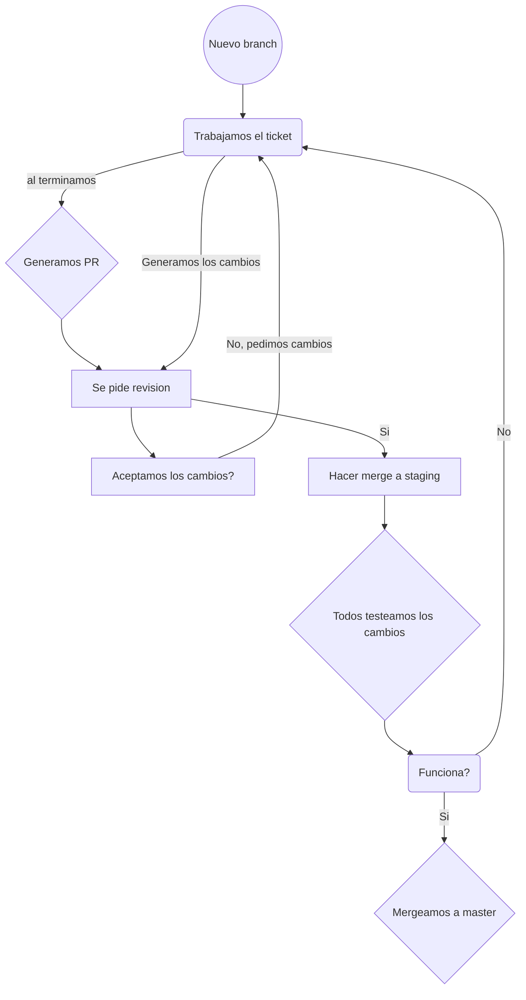

# 2019_TP_PPS_Comanda

Registrate en: https://forms.gle/yZ8xsdWj7W7ECWAG8

# Nombre del equipo
- ## Code for Food

# Integrantes:
 - ### Marcos Ivan Rey 
 - ### Ezequiel Mahafud
 - ### Micaela Saez  

# Nuestra Aplicacion
- *Estamos desarollando una aplicacion para un restaurant con Ionic y firebase*

# ¿Como nos organizamos?
- Nos organizamos a travez de **Jira** con **Tickets**.
- Tambien cada ticket esta relacionado con un branch de Github para mantener la organizacion.
- Tenemos el branch **master** el cual mustra la version final y **staging** en el cual testeamos todos las tareas realizadas por cada integrante.

