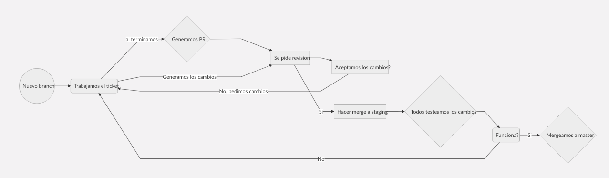

# 2019_TP_PPS_Comanda

Registrate en: https://forms.gle/yZ8xsdWj7W7ECWAG8

# Nombre del equipo
- ## Code for Food

# Integrantes:
 - ### Marcos Ivan Rey 
 - ### Ezequiel Mahafud
 - ### Micaela Saez  

# Nuestra Aplicacion
- *Estamos desarollando una aplicacion para un restaurant con Ionic y firebase*

# ¿Como nos organizamos?
- Nos organizamos a travez de **Jira** con **Tickets**.
- Tambien cada ticket esta relacionado con un branch de Github para mantener la organizacion.
- Tenemos el branch **master** el cual mustra la version final y **staging** en el cual testeamos todos las tareas realizadas por cada integrante.

# Comandos utilizados
- git checkout **rama a cambiar**
- git checkout -b **rama a crear**
- git pull *actualizar rama*
- git push -u origin **rama actual** *para hacer el primer push*
- git status
- git diff
- git add **archivos a agregar**

# Trabajo de Integrantes:

## Marcos Ivan Rey:

| Branch | Descripcion del trabajo | Fecha Finalizacion |
|---|---|---|
| organizacion-proyecto | Creacion de servicion (sin funcionalidad), interfaces y paginas para empezar a trabajar. Esqueleto del proyecto | 17/5 |
| CFF-35/Crear-Auth-Service | Log In y auth service para creacion de usuarios | 25/5 |
| CFF-2/Alta-producto | Creacion de un producto | 30/5 |

## Micaela Saez:

| Branch | Descripcion del trabajo | Fecha Finalizacion |
|---|---|---|
| CFF-4-alta-empleados | Registro de empleado, dueño y supervisor | 28/5 |

## Ezequiel Mahafud:

| Branch | Descripcion del trabajo | Fecha Finalizacion |
|---|---|---|
| Alta-mesa | Registro una nueva mesa | 26/5 |
| Firestorage-service | Arregla errores por el merge de la rama 'Alta-mesa' | 26/5 |
| Fix-app-module | Arregla errores por el merge de la rama 'Alta-mesa' | 26/5 |
